
<h1 align="center">仓库管理信息系统</h1>

## 简介
仓库管理信息系统：角色分为管理员、用户；功能包括员工管理、仓库公告、供应商与客户信息管理、货物进出库管理、库存数据查询与导出、用户注册与登录管理。    --计算机毕业设计源码；毕设源码；java毕业设计源码

## 联系方式

<h3 align="center">获取完整代码与数据库文件 + 微信：deepguan QQ: 86050149 QQ群: 783742310</h3>

<h3 align="center">可帮忙远程部署 包运行成功！提供远程部署、修改代码、设计文档指导、代码讲解等服务！</h3>

## 功能介绍（完整见运行截图）
管理员：基本功能包括登录、注册、退出以及管理个人中心、员工、仓库公告、供应商、客户信息和货物进出。系统提供供应商管理、货物信息管理、入库和出库管理，以及支持富文本编辑的公告发布功能。管理员可以通过导航菜单快速访问各模块，实现信息编辑、保存、提交、查看和删除等操作。通过库存信息的输入和管理，管理员可提高仓库信息管理的效率和准确性，支持导出报表和统计分析。

员工：拥有账号后，可以通过系统进行个人信息管理和操作执行。员工可查看和修改个人中心内容，涉及员工管理、库存管理、供应商和客户信息。系统支持上传图片、编辑信息，以及在货物入库和出库时输入相关信息。员工角色主要负责日常数据维护如补充库存、更新货物信息、记录入库和出库情况，并能使用系统提供的检索、详细查看和数据排序功能，以及通过表格对仓库数据进行直观管理。

供应商：可以查看供应商管理界面，提供增加、删除和修改供应商信息的功能。供应商角色可以在系统中记录和管理供应链相关信息，包括联系信息、地址和备注等。相关信息调整后可通过系统提交保存。该角色的管理界面支持快速查找和导航至特定供应商信息，并可以使用检索和看到历史交易等综合功能，保证供货环节中的数据准确性。

客户：系统支持客户信息的管理，客户可创建和修改个人账户以进行仓库相关活动。其功能包括填写和更新信息，如姓名、联系方式、地址等，并支持查找和查看历史订单数据。该模块允许客户查看特定货物信息，并可与管理员和员工沟通以获得支持和服务。客户通过平台上的功能可以方便地向仓库订货或了解库存动态，确保及时满足需求。

## 运行截图
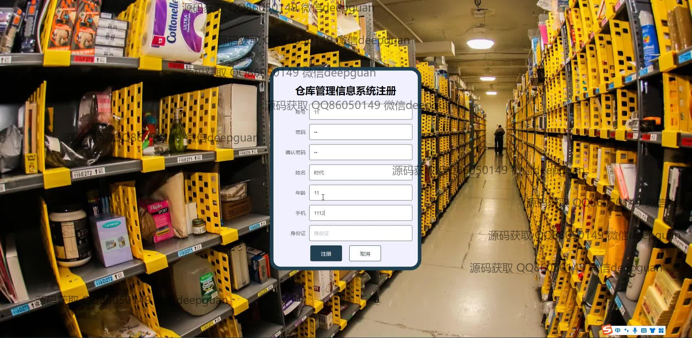
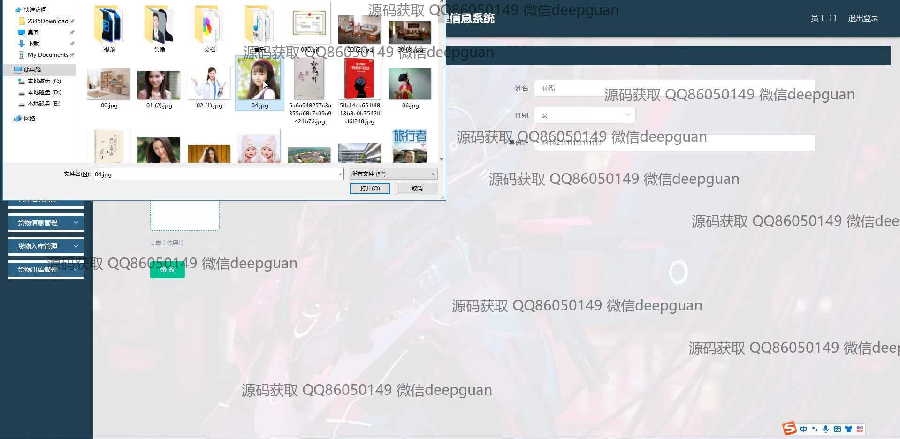
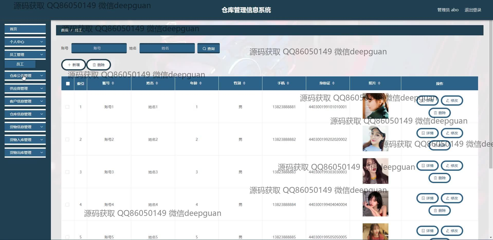
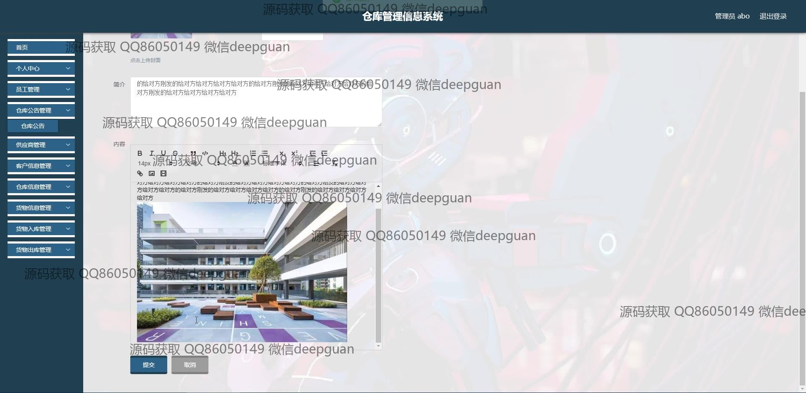
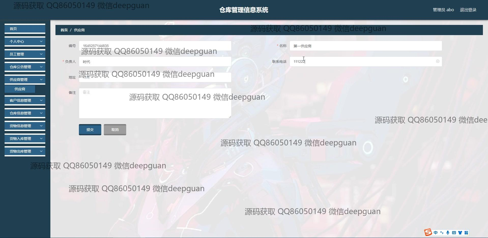
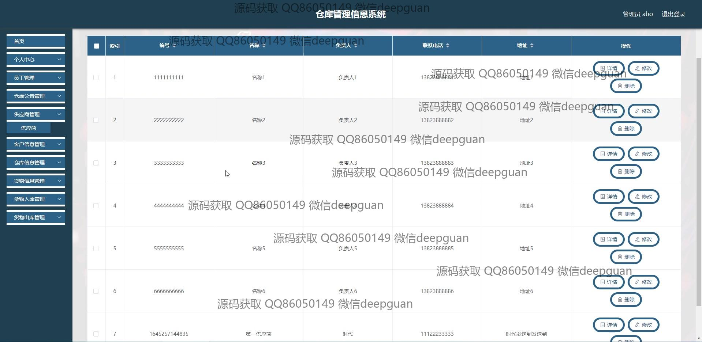
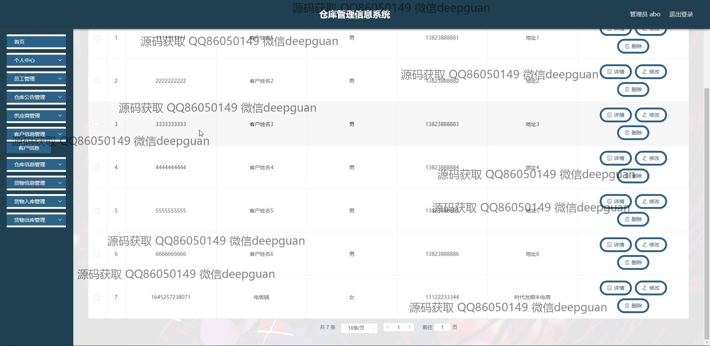
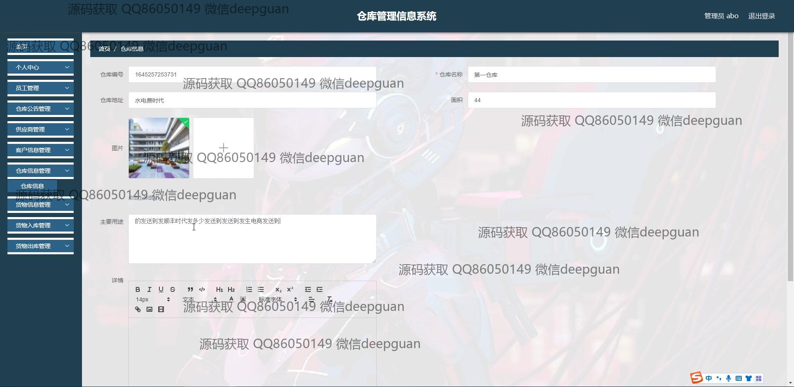
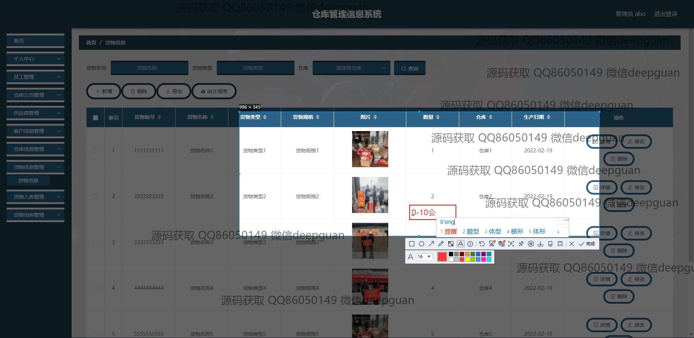
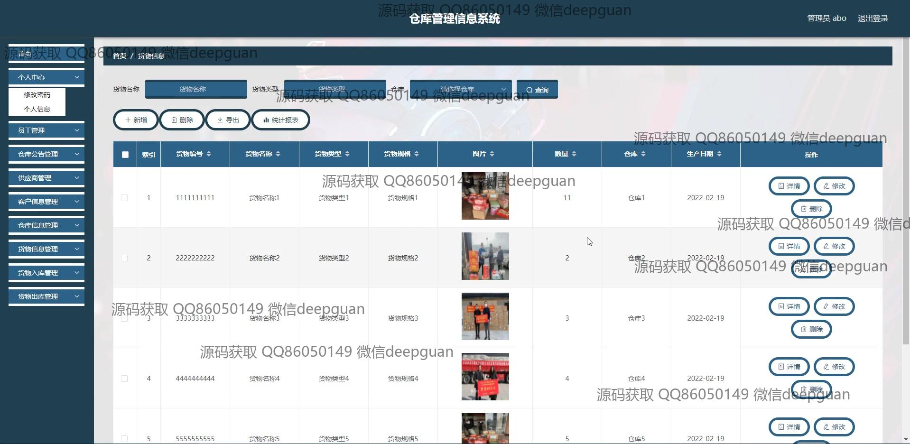
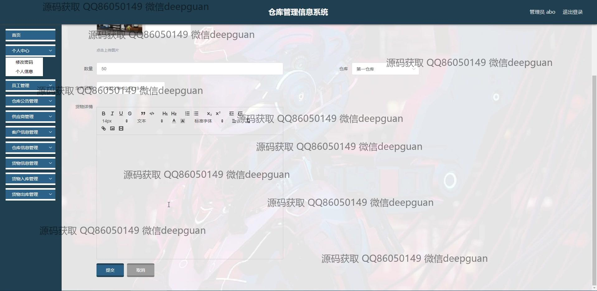
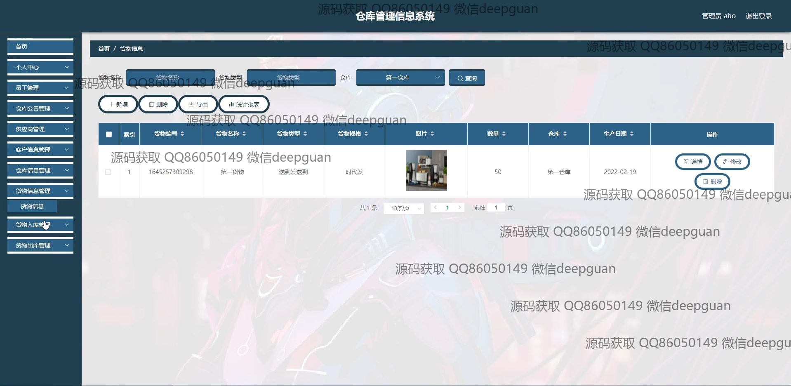
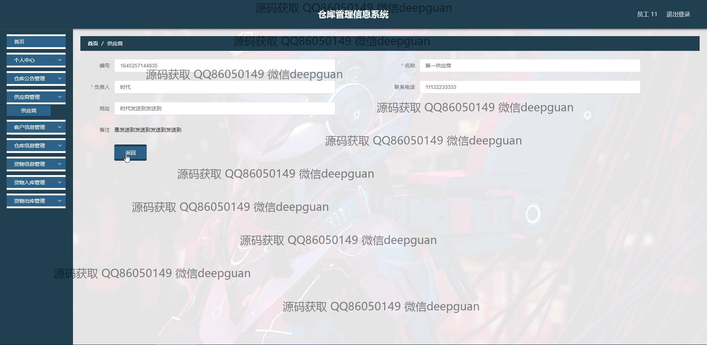
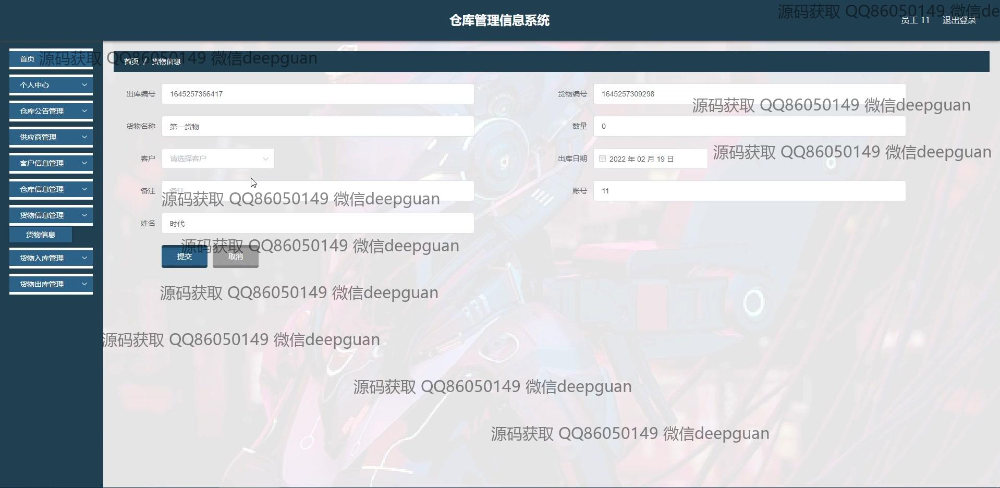
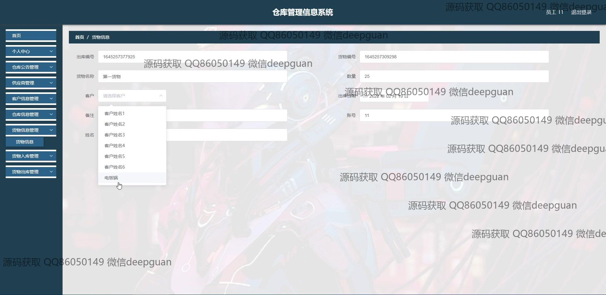
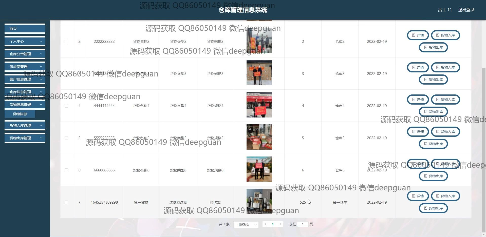

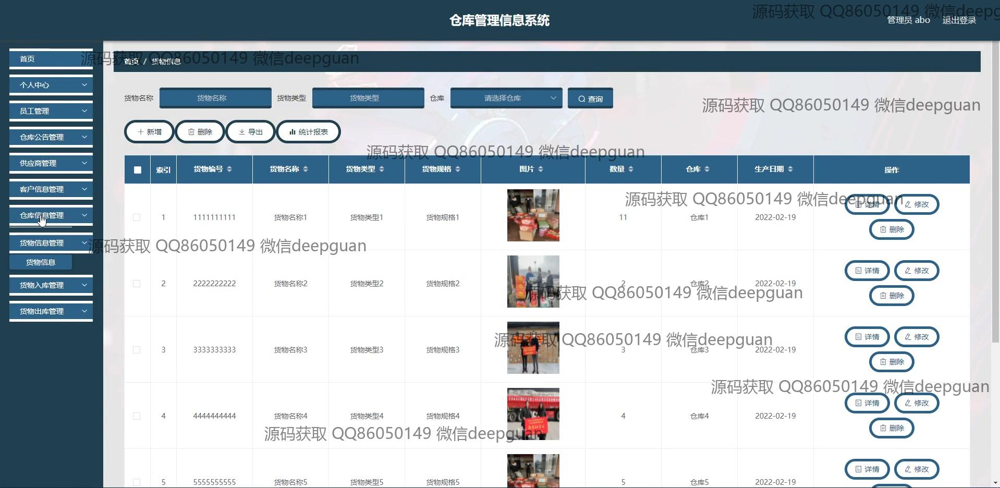

本代码来源于网络,仅供学习参考使用!

